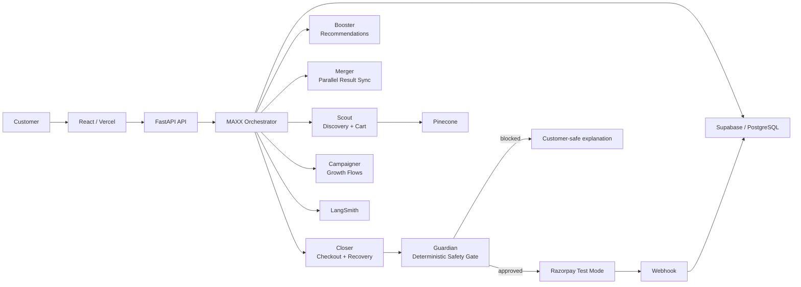

# Merchant MAXX

### Razorpay AI Buildathon 2026 | AI Growth & Agentic Commerce

> A conversational AI shopping agent that turns natural-language intent into a safe, explainable Razorpay transaction.

[](https://github.com/divy-jn/merchant-maxx/actions/workflows/backend-tests.yml)
[](https://www.python.org/)
[](https://react.dev/)
[](https://razorpay.com/)
[](https://www.langchain.com/langgraph)

Merchant MAXX is an AI-native commerce application built around a simple idea: **conversation should be able to reach checkout without giving the language model control of financial state.**

A customer can describe what they want, refine the product choice, select quantities, update a basket, confirm the purchase, pass a deterministic safety gate, and receive a Razorpay checkout — all through a conversational interface.

The LLM handles **intent, context, and language**. The backend remains authoritative for **catalog data, prices, inventory, basket state, customer ownership, transaction limits, confirmation, orders, and payment state**.

---

## What MAXX Does

| Capability | How it works |
|---|---|
| **Conversational shopping** | Natural-language discovery instead of form-heavy storefront navigation |
| **Semantic product search** | Scout retrieves relevant catalog products through Pinecone-backed search |
| **Context-aware selection** | References like “those 2” resolve against the active recommendation and conversation state |
| **Cart operations** | Quantity changes support explicit `ADD` vs `SET` semantics |
| **Multi-agent orchestration** | Scout, Booster, Merger, Closer, Campaigner, and Guardian operate inside LangGraph |
| **Deterministic checkout** | Server-side validation and explicit confirmation precede Razorpay order creation |
| **Guardian safety gate** | Transaction policies are evaluated deterministically before money actions |
| **Payment recovery** | Idempotent order creation and webhook-backed recovery protect against partial failures |
| **Customer-safe responses** | Internal catalog/order/rule identifiers are scrubbed from normal user-facing responses |
| **Authentication** | Customers can register, sign in, and continue with protected commerce actions |
| **Observability** | Agent activity and commerce events can be traced through LangSmith and the backend audit layer |

---

## Agentic Commerce Flow



### The trust boundary

```text
                    UNTRUSTED / GENERATIVE
┌────────────────────────────────────────────────────────┐
│ LLM                                                   │
│ intent • dialogue • refinement • recommendations      │
└───────────────────────────┬────────────────────────────┘
                            │
                            ▼
                    TRUSTED COMMERCE CORE
┌────────────────────────────────────────────────────────┐
│ Backend tools + Supabase                              │
│ price • inventory • basket • ownership • state       │
└───────────────────────────┬────────────────────────────┘
                            │
                            ▼
                    DETERMINISTIC MONEY GATE
┌────────────────────────────────────────────────────────┐
│ Guardian + explicit confirmation                     │
│ policy validation • amount checks • state checks      │
└───────────────────────────┬────────────────────────────┘
                            │
                            ▼
                    RAZORPAY PAYMENT
```

That separation is the core architectural decision in MAXX: **the model can recommend a transaction, but it cannot decide whether money is allowed to move.**

---

## 30-Second Overview

1. Customer asks for a product in plain language.
2. **Scout** searches the catalog and returns a small, relevant shortlist.
3. The customer can refine the choice or refer back to prior results.
4. **Scout** stages basket changes using deterministic quantity semantics.
5. **Closer** moves the purchase toward confirmation and checkout.
6. **Guardian** validates the transaction against server-side policy.
7. Razorpay receives the validated order and handles payment.
8. Webhooks finalize payment state and inventory safely.
9. Partial failures can be recovered without blindly retrying a payment action.

---

## Judge Demo Path

The recommended demo is deliberately built around both the **happy path** and the **failure/recovery path**.

### 1. Happy path — conversational checkout

Start with:

> `I want to buy the latest gaming laptop. Just 1.`

Then refine or select a product conversationally and confirm the purchase.

What to highlight:

- Scout performs product discovery.
- The user never needs to know internal product IDs.
- Closer picks up the purchase context.
- Guardian verifies the server-side state before payment.
- Razorpay checkout is generated only after confirmation and validation.

### 2. Context + quantity semantics

Use a compact conversation such as:

> `Do you have a 2TB SSD?`
>
> `Show me other options.`
>
> `Give me those 2.`
>
> `Add another SSD.`
>
> `Make it 1.`

This demonstrates that conversational references remain tied to the current commerce context and that `ADD` and `SET` are treated as different operations.

### 3. Guardian failure path

Build a basket that exceeds the configured transaction ceiling.

In the current configuration, the maximum transaction value is **₹10,000**.

Guardian blocks the transaction before Razorpay checkout and returns a customer-safe explanation instead of exposing internal policy identifiers.

### 4. Recovery

After the blocked state, modify the basket to bring the total back within the allowed limit and continue.

A representative recovery sequence is:

> `Make it 1.`
>
> `Proceed.`

The system returns to a valid checkout path instead of getting stuck in a confirmation or payment loop.

---

## Transaction Safety

### Every payment action is server-validated

MAXX does not trust model-generated totals, quantities, prices, or payment identifiers.

Before a Razorpay order is created, the backend re-checks:

- customer / conversation ownership
- purchase state
- explicit confirmation
- basket consistency
- current product availability
- current inventory
- server-calculated subtotal and total
- configured Guardian policies

### Guardian policy gate

Guardian runs deterministic safety checks before Razorpay interaction. The current configuration requires explicit confirmation and caps a transaction at **₹10,000**.

A blocked action is translated to customer-safe language, keeping implementation details such as rule identifiers inside the backend rather than leaking them into the chat experience.

### Idempotent payment boundary

Razorpay order creation is designed to be idempotent for a purchase intent. If an order already exists for the same intent, MAXX can return the existing checkout state rather than creating a duplicate order.

### Webhook-backed finalization

Payment completion is not assumed from the frontend alone. Razorpay webhooks feed the backend so payment and inventory finalization can be completed from an authoritative server event.

---

## Failure Cases That Were Hardened

> The interesting part of an agentic-commerce system is what happens when something goes wrong.

**1. Internal IDs leaked into chat**  
Customer-visible responses could contain catalog, recommendation, or order identifiers. MAXX now sanitizes internal identifiers before returning customer-facing text.

**2. Guardian errors exposed implementation details**  
Raw policy names such as `RULE_01_MAX_TX_LIMIT` are converted into customer-safe explanations.

**3. Conversational quantity ambiguity**  
Requests such as “give me those 2”, “add another”, and “make it 1” required explicit semantics. MAXX distinguishes `ADD` from `SET` and keeps the basket authoritative in the backend.

**4. Payment retry loops**  
Failed or unknown payment states could cause blind retries. MAXX routes payment recovery through explicit state handling and avoids treating a previous payment attempt as permission to repeat it indefinitely.

**5. Duplicate order creation**  
Concurrent or repeated checkout actions could create duplicate Razorpay orders. Purchase-intent state transitions and idempotent order checks now guard this boundary.

**6. Inventory race conditions**  
Inventory is decremented atomically during fulfillment instead of trusting the basket-building phase, reducing TOCTOU risk under concurrent orders.

**7. Deployment drift**  
Cloud Build now explicitly builds, pushes, and deploys the container image so production deployment is tied to the committed source revision.

---

## Tech Stack

| Layer | Technology |
|---|---|
| **Frontend** | React 19, Vite, React Router, Recharts, Lucide |
| **Backend** | Python 3.11+, FastAPI, Uvicorn |
| **AI orchestration** | LangGraph + LangChain |
| **LLM** | OpenAI or Gemini, one active provider at a time |
| **Retrieval** | Pinecone |
| **Database & Auth** | Supabase / PostgreSQL + RLS |
| **Payments** | Razorpay Test Mode |
| **Observability** | LangSmith + backend audit layer |
| **Deployment** | Vercel + Google Cloud Run |
| **CI** | GitHub Actions + Pytest |

---

## Repository Layout

```text
merchant-maxx/
├── backend/
│   ├── agents/
│   │   ├── maxx.py          # Main LangGraph orchestration + response sanitization
│   │   ├── scout.py         # Product discovery + basket operations
│   │   ├── booster.py       # Recommendation path
│   │   ├── merger.py        # Parallel result synchronization
│   │   ├── closer.py        # Checkout + payment flow
│   │   ├── guardian.py      # Deterministic safety gate
│   │   └── tools.py         # Commerce tools and payment boundaries
│   ├── routes/
│   │   ├── auth.py          # Registration / authentication
│   │   ├── chat.py          # Chat + deterministic commerce actions
│   │   ├── catalog.py       # Catalog access
│   │   ├── audit.py         # Audit API
│   │   └── webhooks.py      # Razorpay webhook processing
│   ├── middleware/          # Auth, rate limiting, global errors
│   ├── tests/               # Commerce + concurrency + security tests
│   └── main.py              # FastAPI entrypoint
│
├── frontend/
│   └── src/
│       ├── pages/           # Login, registration, chat, app views
│       ├── components/      # Commerce UI
│       └── config.js        # Runtime API URL configuration
│
├── dataset/                 # Catalog / seed data
├── docs/                    # Architecture, commerce, demo, development, security
├── cloudbuild.yaml          # Container build → push → Cloud Run deploy
└── .github/workflows/       # Automated backend validation
```

---

## API Surface

The FastAPI application exposes commerce and observability endpoints including:

| Route | Purpose |
|---|---|
| `/auth/*` | Registration and authentication flows |
| `/catalog/*` | Product catalog access |
| `/chat` | Natural-language commerce interaction |
| `/chat/action` | Deterministic cart, checkout, and payment transitions |
| `/audit/*` | Audit event access |
| `/webhooks/*` | Razorpay payment events and fulfillment |
| `/recommendations/*` | Recommendation-related flows |
| `/acp/*` | Agentic-commerce protocol surfaces |

The exact route implementations live under `backend/routes/`.

---

## Running Locally

### Prerequisites

- Python 3.11+
- Node.js / npm
- Supabase project and credentials
- Pinecone API key
- An LLM API key for the configured provider
- Razorpay test credentials for payment flows

### 1. Configure environment

```bash
git clone https://github.com/divy-jn/merchant-maxx.git
cd merchant-maxx
cp .env.example .env
```

Fill in the environment variables locally. Never commit real credentials.

### 2. Start the backend

```bash
cd backend
python -m pip install -r requirements.txt
python main.py
```

FastAPI runs on the local backend port expected by the frontend configuration.

### 3. Start the frontend

```bash
cd frontend
npm install
npm run dev
```

The frontend uses `VITE_API_URL` when supplied; otherwise the development configuration points to the local backend.

---

## Environment Configuration

The tracked `.env.example` documents the configuration surface without containing credentials.

Important variables include:

```text
LLM_PROVIDER / LLM_MODEL / LLM_API_KEY
RAZORPAY_KEY_ID / RAZORPAY_KEY_SECRET / RAZORPAY_WEBHOOK_SECRET
SUPABASE_URL / SUPABASE_ANON_KEY / SUPABASE_SERVICE_KEY
PINECONE_API_KEY
GUARDIAN_MAX_TRANSACTION_PAISE=1000000
GUARDIAN_REQUIRE_CONFIRMATION=true
APP_ENV=development
CORS_ORIGINS=...
```

Use real secrets only through local environment configuration or managed secret storage.

---

## Testing

Backend tests run with `APP_ENV=test` to keep the suite deterministic and prevent accidental live LLM execution.

```bash
cd backend
APP_ENV=test python -m pytest tests/ -v
```

GitHub Actions runs the same backend test workflow for pushes to `main` and pull requests targeting `main`.

### What the suite protects

- payment state transitions
- Guardian policy enforcement
- concurrent checkout / inventory behavior
- cart quantity semantics
- ownership and authorization boundaries
- webhook handling
- customer-safe error handling
- tool-call and LangGraph execution reliability

---

## Deployment

### Frontend

Vercel hosts the React application.

### Backend

Google Cloud Run hosts the FastAPI container.

`cloudbuild.yaml` performs the production deployment pipeline:

```text
Source commit
    ↓
Docker build
    ↓
Container push
    ↓
Cloud Run deploy
```

The container image is tagged with the commit SHA so the deployed artifact remains traceable to source control.

---

## Documentation

| Document | Purpose |
|---|---|
| [Architecture](docs/ARCHITECTURE.md) | System boundaries, agents, services, and deployment topology |
| [Commerce Flow](docs/COMMERCE_FLOW.md) | Product discovery → basket → Guardian → Razorpay → fulfillment |
| [Demo Guide](docs/DEMO.md) | Recommended judge/demo walkthrough |
| [Development](docs/DEVELOPMENT.md) | Local development and deployment workflow |
| [Security](docs/SECURITY.md) | Auth, RLS, IDOR prevention, payment safety, inventory locking |
| [Agent Guide](docs/AGENTS.md) | Agent roles and implementation guidance |

---

## Project Status

MAXX is submission-focused and the core commerce loop is implemented end-to-end:

```text
Discover → Refine → Select → Cart → Guardian → Confirm → Razorpay → Fulfill → Recover
```

The project deliberately prioritizes a complete, testable agentic-commerce transaction over adding infrastructure that does not strengthen the core money path.

---

## License

MIT — see [LICENSE](LICENSE).
