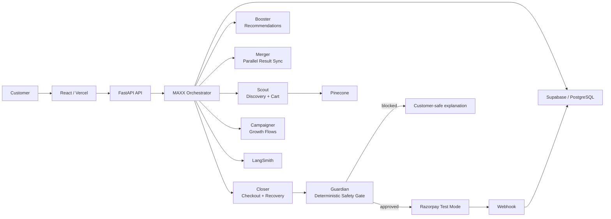

# Merchant MAXX

### Razorpay AI Buildathon 2026 | AI Growth & Agentic Commerce

> A conversational AI shopping agent that turns natural-language intent into a safe, explainable Razorpay transaction.

[](https://github.com/divy-jn/merchant-maxx/actions/workflows/backend-tests.yml)
[](https://www.python.org/)
[](https://react.dev/)
[](https://razorpay.com/)
[](https://www.langchain.com/langgraph)
[](https://cloud.google.com/run)
[](https://smith.langchain.com/)

Merchant MAXX is an AI-native commerce application built around a simple idea: **conversation should be able to reach checkout without giving the language model control of financial state.**

A customer can describe what they want, refine the product choice, select quantities, update a basket, confirm the purchase, pass a deterministic safety gate, and receive a Razorpay checkout — all through a conversational interface.

The LLM handles **intent, context, and language**. The backend remains authoritative for **catalog data, prices, inventory, basket state, customer ownership, transaction limits, confirmation, orders, and payment state**.

---

## What MAXX Does

| Capability | How it works |
|---|---|
| **Conversational shopping** | Natural-language discovery instead of form-heavy storefront navigation |
| **Semantic product search** | Scout retrieves relevant catalog products through Pinecone-backed search |
| **Context-aware selection** | References like “those 2” resolve against the active recommendation and conversation state |
| **Cart operations** | Quantity changes support explicit `ADD` vs `SET` semantics |
| **Multi-agent orchestration** | Scout, Booster, Merger, Closer, Campaigner, and Guardian operate inside LangGraph |
| **Deterministic checkout** | Server-side validation and explicit confirmation precede Razorpay order creation |
| **Guardian safety gate** | Transaction policies are evaluated deterministically before money actions |
| **Payment recovery** | Idempotent order creation and webhook-backed recovery protect against partial failures |
| **Customer-safe responses** | Internal catalog/order/rule identifiers are scrubbed from normal user-facing responses |
| **Authentication** | Customers can register, sign in, and continue with protected commerce actions |
| **Observability** | Agent activity and commerce events can be traced through LangSmith and the backend audit layer |

---

## Agentic Commerce Flow



### The trust boundary

```text
                    UNTRUSTED / GENERATIVE
┌────────────────────────────────────────────────────────┐
│ LLM                                                   │
│ intent • dialogue • refinement • recommendations      │
└───────────────────────────┬────────────────────────────┘
                            │
                            ▼
                    TRUSTED COMMERCE CORE
┌────────────────────────────────────────────────────────┐
│ Backend tools + Supabase                              │
│ price • inventory • basket • ownership • state       │
└───────────────────────────┬────────────────────────────┘
                            │
                            ▼
                    DETERMINISTIC MONEY GATE
┌────────────────────────────────────────────────────────┐
│ Guardian + explicit confirmation                     │
│ policy validation • amount checks • state checks      │
└───────────────────────────┬────────────────────────────┘
                            │
                            ▼
                    RAZORPAY PAYMENT
```

That separation is the core architectural decision in MAXX: **the model can recommend a transaction, but it cannot decide whether money is allowed to move.**

---

## 30-Second Overview

1. Customer asks for a product in plain language.
2. **Scout** searches the catalog and returns a small, relevant shortlist.
3. The customer can refine the choice or refer back to prior results.
4. **Scout** stages basket changes using deterministic quantity semantics.
5. **Closer** moves the purchase toward confirmation and checkout.
6. **Guardian** validates the transaction against server-side policy.
7. Razorpay receives the validated order and handles payment.
8. Webhooks finalize payment state and inventory safely.
9. Partial failures can be recovered without blindly retrying a payment action.

---

## Judge Demo Path

The recommended demo is deliberately built around both the **happy path** and the **failure/recovery path**.

### Happy path — conversational checkout

> `I want to buy the latest gaming laptop. Just 1.`

Highlight Scout discovery, conversational refinement, deterministic confirmation, Guardian validation, and Razorpay checkout.

### Context + quantity semantics

> `Do you have a 2TB SSD?`
>
> `Show me other options.`
>
> `Give me those 2.`
>
> `Add another SSD.`
>
> `Make it 1.`

This demonstrates conversation-aware product references and explicit `ADD` vs `SET` quantity behavior.

### Guardian failure + recovery

Build a basket above the configured **₹10,000** ceiling. Guardian blocks the transaction before Razorpay and returns a customer-safe explanation. Reduce the basket and say:

> `Proceed.`

The system returns to a valid checkout path instead of looping or silently retrying a blocked action.

---

## Transaction Safety

MAXX treats the model as an intent layer, not a financial authority.

Before Razorpay order creation, the backend re-checks customer/conversation ownership, purchase state, explicit confirmation, basket consistency, current product availability, current inventory, server-calculated totals, and Guardian policy.

Razorpay order creation is designed to be idempotent for a purchase intent. Payment completion is finalized from authoritative webhook events, with recovery paths for partial failures.

---

## Failure Cases That Were Hardened

**Internal IDs leaked into chat** → customer-facing sanitization removes catalog, recommendation, purchase, and order identifiers.

**Guardian implementation details leaked** → internal rule names are translated into customer-safe messages.

**Conversational quantity ambiguity** → `ADD` increments and `SET` replaces the requested quantity.

**Payment retry loops** → failed/unknown states use explicit recovery handling rather than blind retries.

**Duplicate order creation** → purchase-intent state transitions and idempotent order checks protect the checkout boundary.

**Inventory race conditions** → fulfillment uses atomic inventory handling to reduce TOCTOU risk.

**Deployment drift** → Cloud Build explicitly builds, pushes, and deploys the commit-tagged container.

---

## Tech Stack

| Layer | Technology |
|---|---|
| **Frontend** | React 19, Vite, React Router, Recharts, Lucide |
| **Backend** | Python 3.11+, FastAPI, Uvicorn |
| **AI orchestration** | LangGraph + LangChain |
| **LLM** | OpenAI or Gemini, one active provider at a time |
| **Retrieval** | Pinecone |
| **Database & Auth** | Supabase / PostgreSQL + RLS |
| **Payments** | Razorpay Test Mode |
| **Observability** | LangSmith + backend audit layer |
| **Deployment** | Vercel + Google Cloud Run |
| **CI** | GitHub Actions + Pytest |

---

## Repository Layout

```text
merchant-maxx/
├── backend/
│   ├── agents/
│   │   ├── maxx.py          # Main LangGraph orchestration + sanitization
│   │   ├── scout.py         # Product discovery + basket operations
│   │   ├── booster.py       # Recommendation path
│   │   ├── merger.py        # Parallel result synchronization
│   │   ├── closer.py        # Checkout + payment flow
│   │   ├── guardian.py      # Deterministic safety gate
│   │   └── tools.py         # Commerce tools + payment boundaries
│   ├── routes/
│   │   ├── auth.py          # Registration / authentication
│   │   ├── chat.py          # Chat + deterministic commerce actions
│   │   ├── catalog.py       # Catalog access
│   │   ├── audit.py         # Audit API
│   │   └── webhooks.py      # Razorpay webhook processing
│   ├── middleware/          # Auth, rate limiting, global errors
│   ├── tests/               # Commerce, concurrency, security tests
│   └── main.py              # FastAPI entrypoint
│
├── frontend/                # React / Vite client
├── dataset/                 # Catalog / seed data
├── docs/                    # Architecture, commerce, demo, development, security
├── cloudbuild.yaml          # Container build → push → Cloud Run deploy
└── .github/workflows/       # Automated backend validation
```

---

## API Surface

| Route | Purpose |
|---|---|
| `/auth/*` | Registration and authentication |
| `/catalog/*` | Product catalog access |
| `/chat` | Natural-language commerce interaction |
| `/chat/action` | Deterministic cart, checkout, and payment transitions |
| `/audit/*` | Audit event access |
| `/webhooks/*` | Razorpay payment events and fulfillment |
| `/recommendations/*` | Recommendation-related flows |
| `/acp/*` | Agentic-commerce protocol surfaces |

---

## Running Locally

### Prerequisites

- Python 3.11+
- Node.js / npm
- Supabase project and credentials
- Pinecone API key
- LLM API key for the configured provider
- Razorpay test credentials for payment flows

### Configure environment

```bash
git clone https://github.com/divy-jn/merchant-maxx.git
cd merchant-maxx
cp .env.example .env
```

Fill in the local environment values. Never commit real credentials.

### Start the backend

```bash
cd backend
python -m pip install -r requirements.txt
python main.py
```

### Start the frontend

```bash
cd frontend
npm install
npm run dev
```

The frontend uses `VITE_API_URL` when supplied; otherwise development defaults to the local backend.

---

## Environment Configuration

The tracked `.env.example` documents the configuration surface without containing credentials.

```text
LLM_PROVIDER / LLM_MODEL / LLM_API_KEY
RAZORPAY_KEY_ID / RAZORPAY_KEY_SECRET / RAZORPAY_WEBHOOK_SECRET
SUPABASE_URL / SUPABASE_ANON_KEY / SUPABASE_SERVICE_KEY
PINECONE_API_KEY
GUARDIAN_MAX_TRANSACTION_PAISE=1000000
GUARDIAN_REQUIRE_CONFIRMATION=true
APP_ENV=development
CORS_ORIGINS=...
```

---

## Testing

Backend tests run with `APP_ENV=test` to keep the suite deterministic and prevent accidental live LLM execution.

```bash
cd backend
APP_ENV=test python -m pytest tests/ -v
```

GitHub Actions runs the backend test workflow for pushes to `main` and pull requests targeting `main`.

The suite covers payment state transitions, Guardian enforcement, concurrent checkout/inventory behavior, cart quantity semantics, ownership/authorization, webhooks, customer-safe errors, and LangGraph tool execution reliability.

---

## Deployment

### Frontend

Vercel hosts the React application.

### Backend

Google Cloud Run hosts the FastAPI container. `cloudbuild.yaml` performs:

```text
Source commit
    ↓
Docker build
    ↓
Container push
    ↓
Cloud Run deploy
```

The container image is tagged with the commit SHA so the deployed artifact remains traceable to source control.

---

## Documentation

| Document | Purpose |
|---|---|
| [Architecture](docs/ARCHITECTURE.md) | System boundaries, agents, services, deployment topology |
| [Commerce Flow](docs/COMMERCE_FLOW.md) | Product discovery → basket → Guardian → Razorpay → fulfillment |
| [Demo Guide](docs/DEMO.md) | Recommended judge/demo walkthrough |
| [Development](docs/DEVELOPMENT.md) | Local development and deployment workflow |
| [Security](docs/SECURITY.md) | Auth, RLS, IDOR prevention, payment safety, inventory locking |
| [Agent Guide](docs/AGENTS.md) | Agent roles and implementation guidance |

---

## Project Status

MAXX is submission-focused and the core commerce loop is implemented end-to-end:

```text
Discover → Refine → Select → Cart → Guardian → Confirm → Razorpay → Fulfill → Recover
```

The project deliberately prioritizes a complete, testable agentic-commerce transaction over adding infrastructure that does not strengthen the core money path.

---

## License

MIT — see [LICENSE](LICENSE).
