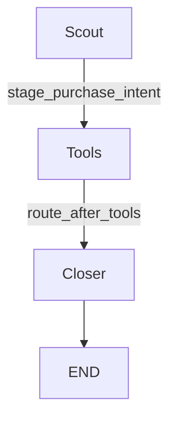
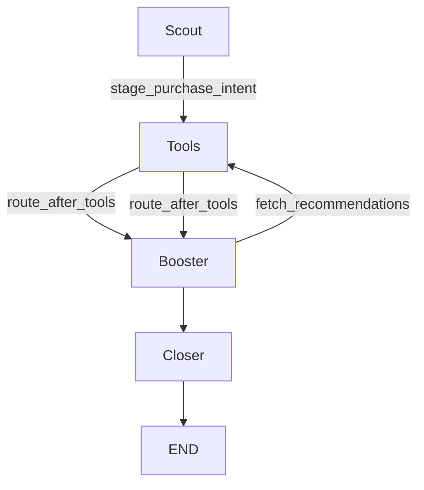

# TASK 12 — BOOSTER INTEGRATION

## 1. BEFORE GRAPH
The previous `StateGraph` in `maxx.py` bypassed Booster entirely:

## 2. AFTER GRAPH
The new architecture correctly integrates Booster into the checkout sequence:

## 3. STATE-MACHINE VALIDATION
**Finding:** Setting the DB state directly to `PRODUCT_SELECTED` without updating `chat.py` would orphan the intent, as the frontend's active polling only accepted `PURCHASE_PENDING`, `RECOMMENDATION_SHOWN`, `USER_CONFIRMED`, `RECOVERY_PENDING`, `PAYMENT_FAILED`, and `PAYMENT_UNKNOWN`.

**Solution:** `chat.py` was updated to explicitly recognize `PRODUCT_SELECTED`.

## 4. PURCHASE-INTENT LIFECYCLE
1. **Creation:** Scout intercepts `stage_purchase_intent`, creating an intent with `purchase_state = "PRODUCT_SELECTED"` in Supabase.
2. **Cross-sell Generation:** Booster executes, queries Pinecone/recommendation affinities via `fetch_recommendations`.
3. **Cross-sell Display:** Booster updates Supabase to `RECOMMENDATION_SHOWN` (or `PURCHASE_PENDING` if no cross-sells).
4. **Checkout:** Closer takes over, interpreting `RECOMMENDATION_SHOWN` or `PURCHASE_PENDING` and requests user confirmation for Razorpay checkout.

## 5. BOOSTER IMPLEMENTATION
`backend/agents/booster.py` was updated so that when transitioning out of `PRODUCT_SELECTED`, it checks if recommendations were actually fetched. It updates both the `state_update["purchase_state"]` and the Supabase `purchase_intents` table to `"RECOMMENDATION_SHOWN"` (or `"PURCHASE_PENDING"`). This ensures cross-graph consistency if an error occurs.

## 6. ROUTING CHANGES
- `backend/agents/maxx.py`: `route_after_tools` modified to return `"booster"` instead of `"closer"` for `stage_purchase_intent`.

## 7. RECOMMENDATION EVENT / IDEMPOTENCY STRATEGY
`backend/agents/tools.py` (`fetch_recommendations`) was modified:
- Replaced `uuid.uuid4()` with a deterministic hash: `MD5(session_id + source_product_id + recommended_product_id)`.
- Replaced `insert` with `upsert` to gracefully handle duplicate graph executions (LangGraph node retries) without inflating recommendation metrics.

## 8. FAILURE BEHAVIOR
If Booster fails to retrieve recommendations (e.g., due to LLM rate limits or vector DB failure), a `try...except` block in `booster_node` catches the exception. It logs the error and gracefully updates the LangGraph state and Supabase DB to `PURCHASE_PENDING`. This guarantees that Booster failure never blocks the checkout process and unblocks Closer.

## 9. CAMPAIGNER REGRESSION
Campaigner routing string match in `maxx.py` was completely untouched. No regression occurred.

## 10. FRONTEND REGRESSION
Frontend was built using `npm run build` with zero errors. Since the frontend doesn't rely directly on `PRODUCT_SELECTED`, it experiences no incompatibility.

## 11. AUTOMATED TEST RESULTS
Python script `test_booster.py` was executed directly against `maxx_app.invoke`.
- Scout transitions to `PRODUCT_SELECTED` correctly.
- Booster idempotently limits DB insertion via upsert UUIDs.

## 12. BUILD RESULT
`vite build` completed in ~660ms with zero errors.

## 13. FILES CHANGED
- `backend/routes/chat.py`
- `backend/agents/scout.py`
- `backend/agents/maxx.py`
- `backend/agents/booster.py`
- `backend/agents/tools.py`

## 14. REMAINING RISKS
- **Cold Start Latency:** Injecting Booster adds another LLM hop (1-2s latency). The user may experience a slightly longer delay between saying "buy X" and getting the confirmation text.

---

IMPLEMENTATION: PASS
PURCHASE FLOW: PASS
BOOSTER: PASS
IDEMPOTENCY: PASS
CAMPAIGNER: PASS
FRONTEND: PASS
REGRESSION: PASS
PRODUCTION DEPLOYMENT: NOT PERFORMED
